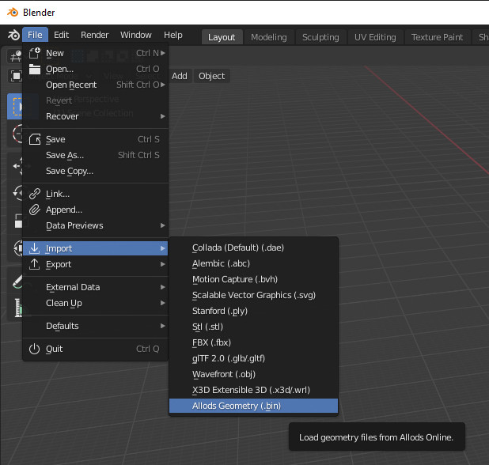

# Allods geometry blender importer

Requires [Blender](https://www.blender.org/download/). 

**WARNING**: It has been tested on Blender 2.90 only.

## Installation 

Follow : https://docs.blender.org/manual/en/latest/editors/preferences/addons.html

## Usage

*To import geometry you need the `.xdb` metadata file associated to the geometry you want to import. You can find sample files in [samples](samples) directory in this repository.*

***WIP**: A tool to extract these files from game client is in progress.*

* After, installation you can find a new menu in Blender import menu.

* Select your `.xdb` metadata file to import (`.bin` file must be in same directory with same filename before extension). You can choose to import all [LOD](https://fr.wikipedia.org/wiki/Level_of_detail) models by selecting the `Import LODs` option. Otherwise it will load only the best quality model (LOD=0).

* Click on `Import geometry` and the model should appear in viewport.

## Features

### UV map import

[UV Maps](https://en.wikipedia.org/wiki/UV_mapping) are imported by the addon. You can then use images to apply textures on models. Textures can be extracted from game client using [AoTextureViewer](https://alloder.pro/files/file/361-ao-texture-viewer/) tool.

## Planned features

* Animation import
* Skeleton import

